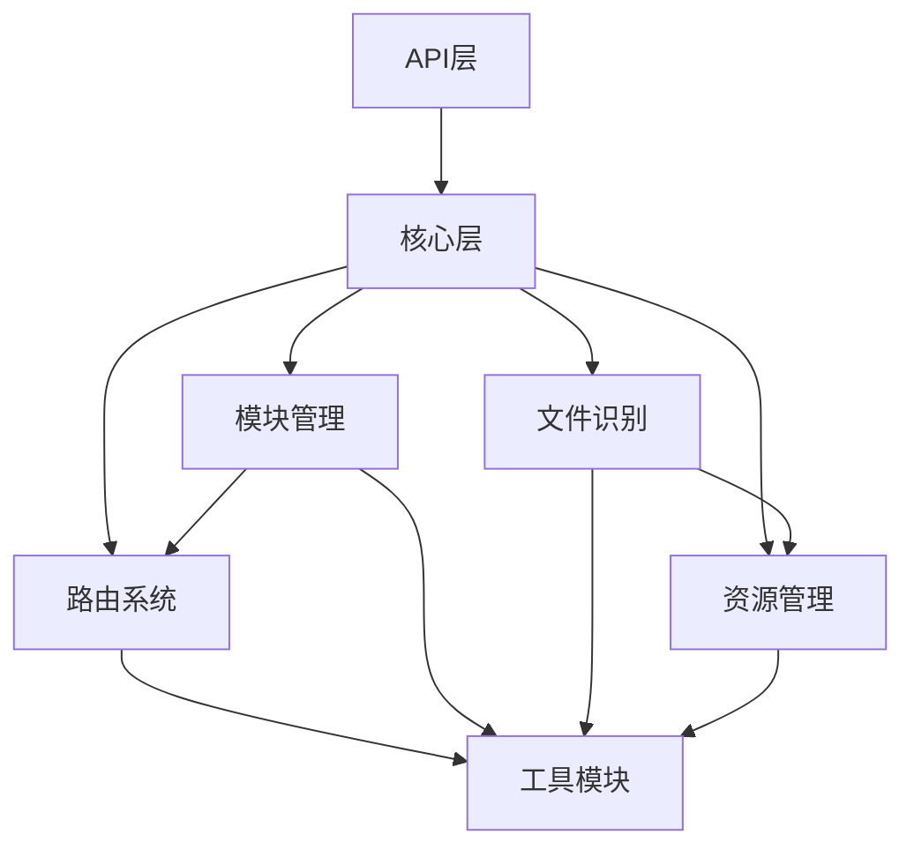

# 08-代码模块划分

## 8.1 项目目录结构

```
chips-core/
├── Cargo.toml                  # 项目配置
├── README.md
├── LICENSE
├── .gitignore
│
├── src/
│   ├── main.rs                 # 入口点
│   ├── lib.rs                  # 库入口
│   │
│   ├── core/                   # 核心层
│   │   ├── mod.rs
│   │   ├── core.rs             # Core trait 实现
│   │   └── config.rs           # 配置加载
│   │
│   ├── router/                 # 路由系统
│   │   ├── mod.rs
│   │   ├── router.rs           # Router trait 实现
│   │   ├── route_table.rs      # 路由表
│   │   ├── request.rs          # 请求/响应
│   │   ├── queue.rs            # 请求队列
│   │   ├── processor.rs        # 请求处理器
│   │   └── event_bus.rs        # 事件总线
│   │
│   ├── module/                 # 模块管理
│   │   ├── mod.rs
│   │   ├── manager.rs          # ModuleManager
│   │   ├── registry.rs         # 模块注册表
│   │   ├── metadata.rs         # 模块元数据
│   │   ├── loader.rs           # 模块加载器
│   │   ├── dependency.rs       # 依赖解析
│   │   ├── lifecycle.rs        # 生命周期管理
│   │   └── runtime/            # 运行时管理器
│   │       ├── mod.rs
│   │       ├── js.rs           # JavaScript运行时
│   │       ├── python.rs       # Python运行时
│   │       └── wasm.rs         # WASM运行时
│   │
│   ├── file/                   # 文件识别
│   │   ├── mod.rs
│   │   ├── recognizer.rs       # 文件识别器
│   │   ├── file_type.rs        # 文件类型定义
│   │   ├── detector/           # 检测器
│   │   │   ├── mod.rs
│   │   │   ├── extension.rs    # 扩展名检测
│   │   │   ├── magic.rs        # 魔数检测
│   │   │   └── mime.rs         # MIME检测
│   │   └── card/               # 卡片解析
│   │       ├── mod.rs
│   │       ├── parser.rs       # 卡片解析器
│   │       ├── metadata.rs     # 卡片元数据
│   │       └── structure.rs    # 卡片结构
│   │
│   ├── resource/               # 资源管理
│   │   ├── mod.rs
│   │   ├── manager.rs          # ResourceManager
│   │   ├── provider/           # 资源提供者
│   │   │   ├── mod.rs
│   │   │   ├── local.rs        # 本地文件
│   │   │   ├── http.rs         # HTTP
│   │   │   └── webdav.rs       # WebDAV
│   │   ├── resolver.rs         # 路径解析
│   │   ├── cache.rs            # 缓存管理
│   │   └── auth.rs             # 认证管理
│   │
│   ├── utils/                  # 工具模块
│   │   ├── mod.rs
│   │   ├── logger.rs           # 日志系统
│   │   ├── error.rs            # 错误类型
│   │   ├── id.rs               # ID生成
│   │   └── crypto.rs           # 加密工具
│   │
│   └── api/                    # API层
│       ├── mod.rs
│       ├── sdk.rs              # SDK接口
│       ├── http.rs             # HTTP API
│       ├── cli.rs              # CLI接口
│       └── ipc.rs              # IPC接口
│
├── tests/                      # 集成测试
│   ├── router_test.rs
│   ├── module_test.rs
│   └── ...
│
├── benches/                    # 性能测试
│   ├── router_bench.rs
│   └── ...
│
├── examples/                   # 示例代码
│   ├── basic_usage.rs
│   ├── custom_module.rs
│   └── ...
│
└── docs/                       # 文档
    ├── api/
    ├── guides/
    └── ...
```

## 8.2 核心模块职责

### 8.2.1 core模块

**职责**：
- 内核初始化和启动
- 协调各子系统
- 提供统一的API接口

**关键类型**：
- `ChipsCore`: 内核主结构体
- `CoreConfig`: 配置结构
- `CoreState`: 内核状态

### 8.2.2 router模块

**职责**：
- 路由请求和响应
- 管理路由表
- 事件广播

**关键类型**：
- `Router`: 路由器
- `RouteTable`: 路由表
- `RequestQueue`: 请求队列
- `EventBus`: 事件总线

### 8.2.3 module模块

**职责**：
- 模块扫描和注册
- 模块加载和卸载
- 依赖管理
- 生命周期管理

**关键类型**：
- `ModuleManager`: 模块管理器
- `ModuleRegistry`: 模块注册表
- `ModuleLoader`: 模块加载器
- `DependencyResolver`: 依赖解析器

### 8.2.4 file模块

**职责**：
- 文件类型识别
- 卡片文件解析
- 文件验证

**关键类型**：
- `FileRecognizer`: 文件识别器
- `CardParser`: 卡片解析器
- `FileType`: 文件类型枚举

### 8.2.5 resource模块

**职责**：
- 资源访问抽象
- 缓存管理
- 认证管理

**关键类型**：
- `ResourceManager`: 资源管理器
- `ResourceProvider`: 资源提供者trait
- `CacheManager`: 缓存管理器
- `AuthManager`: 认证管理器

### 8.2.6 utils模块

**职责**：
- 日志记录
- 错误处理
- 通用工具函数

**关键类型**：
- `Logger`: 日志记录器
- `Error`: 错误类型
- `Result<T>`: 结果类型

## 8.3 模块依赖关系



## 8.4 Cargo.toml配置

```toml
[package]
name = "chips-core"
version = "1.0.0"
edition = "2021"
authors = ["Chips Team"]
license = "MIT"
repository = "https://github.com/chips/core"
description = "Chips生态的核心内核"

[dependencies]
# 异步运行时
tokio = { version = "1.35", features = ["full"] }
async-trait = "0.1"
futures = "0.3"

# 序列化
serde = { version = "1.0", features = ["derive"] }
serde_json = "1.0"
serde_yaml = "0.9"
rmp-serde = "1.1"  # MessagePack

# 版本管理
semver = "1.0"

# 时间处理
chrono = { version = "0.4", features = ["serde"] }

# UUID
uuid = { version = "1.6", features = ["v4", "serde"] }

# 正则表达式
regex = "1.10"

# 文件类型检测
infer = "0.15"
tree_magic_mini = "3.0"

# HTTP客户端
reqwest = { version = "0.11", features = ["json", "stream"] }

# ZIP处理
zip = "0.6"

# LRU缓存
lru = "0.12"

# 日志
tracing = "0.1"
tracing-subscriber = { version = "0.3", features = ["json"] }

# 错误处理
thiserror = "1.0"
anyhow = "1.0"

# 密钥存储
keyring = "2.0"

# 命令行
clap = { version = "4.4", features = ["derive"] }

# 嵌入式数据库
sled = "0.34"

# 配置管理
config = "0.13"

# 跨平台路径
path-clean = "1.0"

[dev-dependencies]
# 测试
criterion = "0.5"  # 性能测试
mockall = "0.12"   # Mock
tempfile = "3.8"   # 临时文件

[lib]
name = "chips_core"
path = "src/lib.rs"

[[bin]]
name = "chips-core"
path = "src/main.rs"

[profile.release]
opt-level = 3
lto = true
codegen-units = 1
```

## 8.5 特性标志（Features）

```toml
[features]
default = ["http-api", "cli"]

# HTTP API支持
http-api = ["axum", "tower"]

# CLI支持
cli = ["clap"]

# WebDAV支持
webdav = ["reqwest/native-tls"]

# Python运行时
python-runtime = ["pyo3"]

# WASM运行时
wasm-runtime = ["wasmtime"]

# 完整功能
full = ["http-api", "cli", "webdav", "python-runtime", "wasm-runtime"]
```

## 8.6 编译优化

### 8.6.1 发布配置

```toml
[profile.release]
opt-level = 3              # 最高优化级别
lto = true                 # 链接时优化
codegen-units = 1          # 单个代码生成单元（更好的优化）
strip = true               # 移除符号表
panic = "abort"            # panic时直接终止（减小体积）
```

### 8.6.2 开发配置

```toml
[profile.dev]
opt-level = 0              # 不优化，快速编译
debug = true               # 包含调试信息
```

### 8.6.3 测试配置

```toml
[profile.test]
opt-level = 1              # 轻度优化
debug = true
```

## 8.7 模块可见性

### 8.7.1 公开API

```rust
// src/lib.rs
pub mod core;
pub mod router;
pub mod module;
pub mod resource;
pub mod file;

// 重导出常用类型
pub use core::{ChipsCore, CoreConfig};
pub use router::{Router, RouteRequest, RouteResponse};
pub use module::{ModuleManager, ModuleMetadata};
pub use resource::ResourceManager;
pub use file::FileRecognizer;

// 工具模块
pub use utils::error::{Error, Result};
```

### 8.7.2 内部模块

```rust
// 不公开的内部实现
mod utils;
mod api;
```

## 8.8 命名约定

### 8.8.1 模块命名

- 模块名使用小写加下划线：`module_manager.rs`
- 模块目录与模块同名：`router/`

### 8.8.2 类型命名

- 结构体：PascalCase - `RouteTable`
- 枚举：PascalCase - `FileType`
- Trait：PascalCase - `ResourceProvider`
- 函数：snake_case - `load_module`
- 常量：SCREAMING_SNAKE_CASE - `MAX_QUEUE_SIZE`

### 8.8.3 文件命名

- 主要类型的文件与类型同名（转snake_case）
- 测试文件：`*_test.rs`
- 基准测试：`*_bench.rs`

## 8.9 文档组织

```
docs/
├── api/                    # API文档（cargo doc生成）
├── guides/                 # 开发指南
│   ├── getting-started.md
│   ├── module-development.md
│   └── ...
├── architecture/           # 架构文档
│   ├── overview.md
│   └── ...
└── examples/               # 示例代码
    └── ...
```

## 8.10 测试组织

### 8.10.1 单元测试

```rust
// 在同一文件内
#[cfg(test)]
mod tests {
    use super::*;
    
    #[test]
    fn test_route_table() {
        // ...
    }
}
```

### 8.10.2 集成测试

```rust
// tests/router_test.rs
use chips_core::*;

#[tokio::test]
async fn test_route_request() {
    // ...
}
```

### 8.10.3 性能测试

```rust
// benches/router_bench.rs
use criterion::{black_box, criterion_group, criterion_main, Criterion};

fn route_benchmark(c: &mut Criterion) {
    c.bench_function("route_request", |b| {
        b.iter(|| {
            // ...
        });
    });
}

criterion_group!(benches, route_benchmark);
criterion_main!(benches);
```

---

清晰的模块划分是大型项目可维护性的关键。每个模块职责单一，依赖关系清晰。
