# 04-业务流程

## 4.1 内核启动流程

### 4.1.1 完全独立模式启动

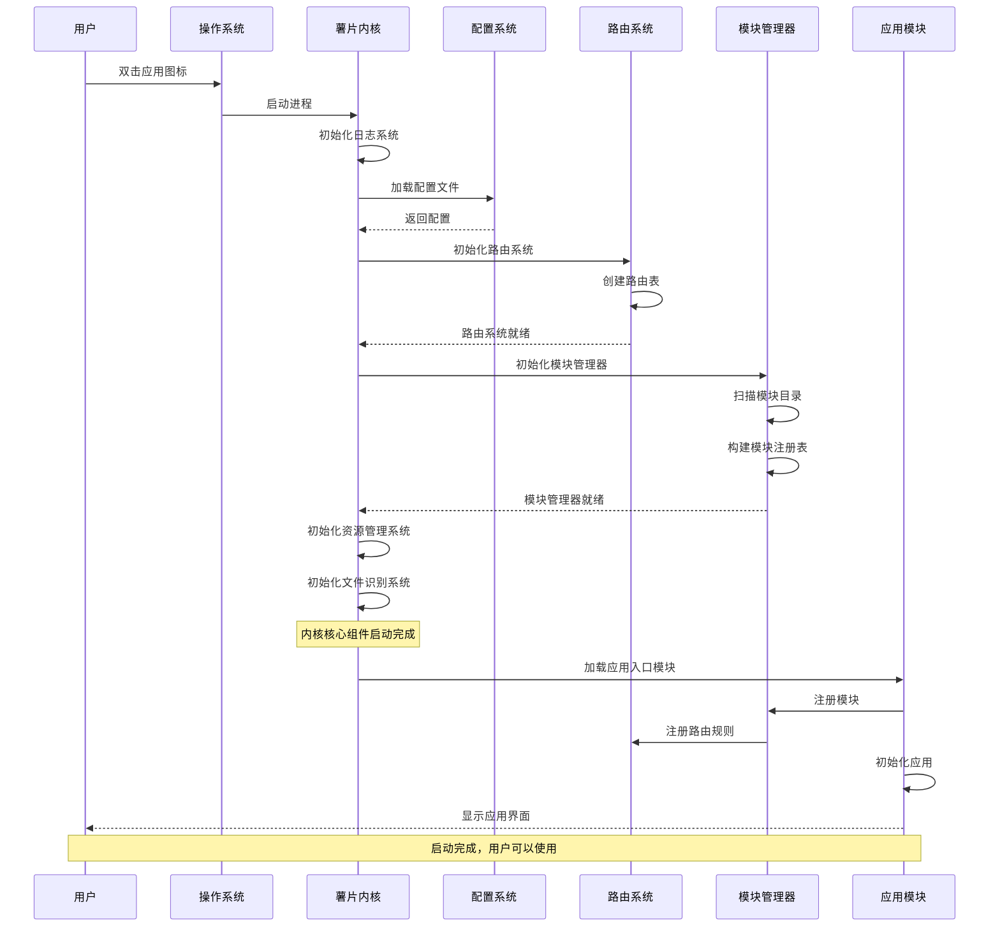

**流程说明**：

1. **进程启动**（0-50ms）
   - 操作系统启动内核进程
   - 分配内存，初始化基础环境

2. **日志系统初始化**（50-70ms）
   - 创建日志输出对象
   - 加载日志配置
   - 打开日志文件

3. **配置加载**（70-120ms）
   - 读取默认配置
   - 读取用户配置
   - 合并配置，用户配置覆盖默认配置
   - 验证配置有效性

4. **路由系统初始化**（120-180ms）
   - 创建路由表数据结构
   - 初始化请求队列
   - 启动路由处理线程/协程

5. **模块管理器初始化**（180-300ms）
   - 扫描模块目录，读取所有module.yaml
   - 构建模块注册表
   - 不加载模块代码，只记录元数据

6. **资源管理系统初始化**（300-350ms）
   - 初始化缓存系统
   - 加载资源搜索路径配置
   - 初始化网络客户端

7. **文件识别系统初始化**（350-400ms）
   - 加载文件类型定义
   - 构建文件类型映射表

8. **加载应用入口模块**（400-500ms）
   - 根据启动参数或配置确定应用入口模块
   - 加载模块代码
   - 模块向内核注册
   - 模块初始化

9. **显示应用界面**（500ms+）
   - 应用模块创建窗口
   - 渲染界面
   - 等待用户交互

**性能指标**：
- 冷启动时间：< 500ms
- 热启动时间：< 100ms（利用操作系统缓存）

### 4.1.2 共享内核模式启动

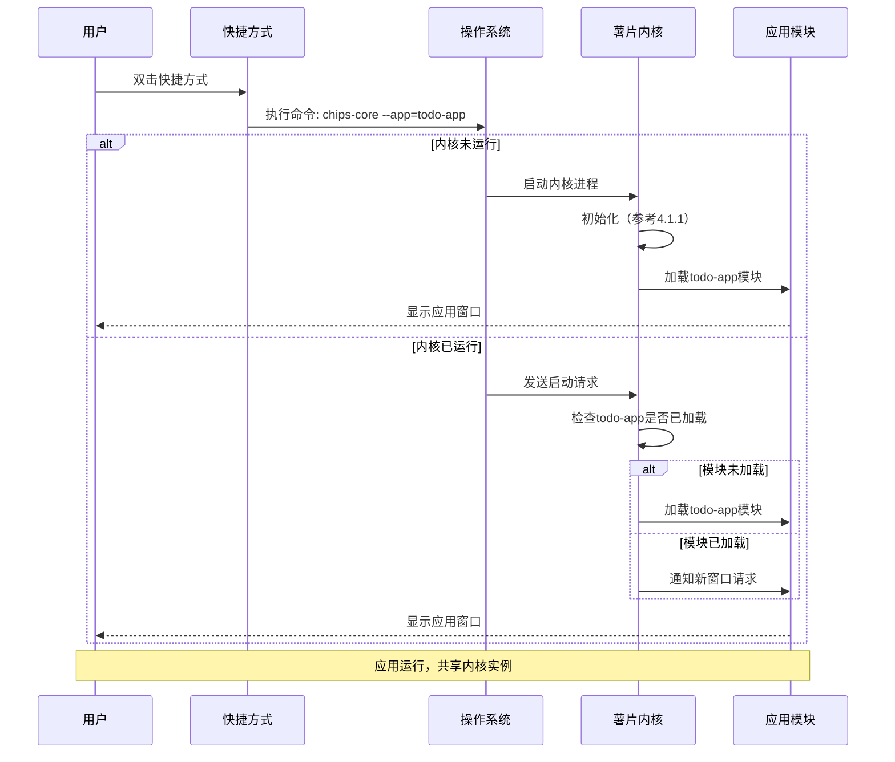

**流程说明**：

1. **快捷方式执行**
   - 快捷方式包含启动命令和应用ID参数
   - 例如：`chips-core --app=todo-app`

2. **检查内核状态**
   - 操作系统检查内核进程是否已运行
   - 通过进程锁文件或进程名称判断

3. **内核未运行**
   - 启动内核进程
   - 完整的初始化流程
   - 加载指定的应用模块

4. **内核已运行**
   - 通过IPC（进程间通信）发送启动请求
   - 内核接收请求，提取应用ID
   - 检查模块是否已加载
   - 如果未加载，按需加载
   - 如果已加载，通知模块创建新窗口实例

**优势**：
- 第二个及后续应用启动极快（< 100ms）
- 多个应用共享内存，资源占用低
- 应用间可以方便地通信

## 4.2 模块通信流程

### 4.2.1 标准路由请求流程

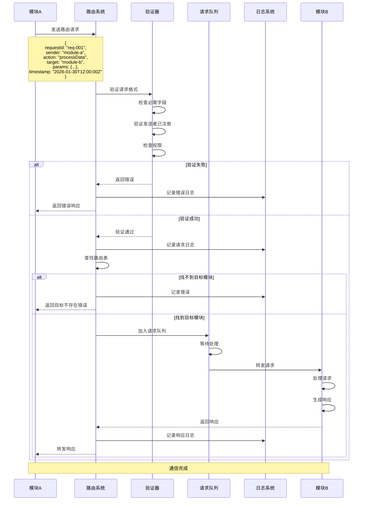

**详细步骤**：

**步骤1：发送请求**（模块A）
- 模块A调用SDK提供的路由接口
- 构造标准请求对象
- 发送到内核路由系统

**步骤2：请求验证**（内核）
- 检查请求格式是否符合标准（JSON Schema验证）
- 验证必需字段：requestId、sender、action
- 检查sender是否是已注册的模块
- 验证sender是否有权限发送此类请求
- 如果验证失败，生成错误响应，直接返回

**步骤3：路由查找**（内核）
- 根据action和target查找路由表
- 如果指定了target，直接查找目标模块
- 如果未指定target，根据action查找默认处理模块
- 如果找不到目标模块，返回"目标不存在"错误

**步骤4：请求排队**（内核）
- 将请求加入请求队列
- 如果设置了优先级，插入到对应优先级位置
- 队列满时，根据策略处理（拒绝/等待/替换旧请求）

**步骤5：转发请求**（内核）
- 从队列中取出请求
- 为请求设置超时时间
- 转发给目标模块B
- 记录路由日志

**步骤6：处理请求**（模块B）
- 接收请求
- 解析参数
- 执行业务逻辑
- 构造响应对象

**步骤7：返回响应**（模块B）
- 将响应发送回内核
- 响应包含：requestId（关联原请求）、status、data、error

**步骤8：转发响应**（内核）
- 根据requestId找到原始发送者（模块A）
- 转发响应给模块A
- 记录响应日志
- 清理请求上下文

**步骤9：接收响应**（模块A）
- 接收响应
- 解析响应数据
- 继续后续业务逻辑

**错误处理**：

1. **格式错误**：立即返回，错误码400
2. **权限错误**：立即返回，错误码403
3. **目标不存在**：立即返回，错误码404
4. **请求超时**：30秒后取消，错误码408
5. **目标模块错误**：返回模块的错误信息，错误码500

### 4.2.2 事件广播流程

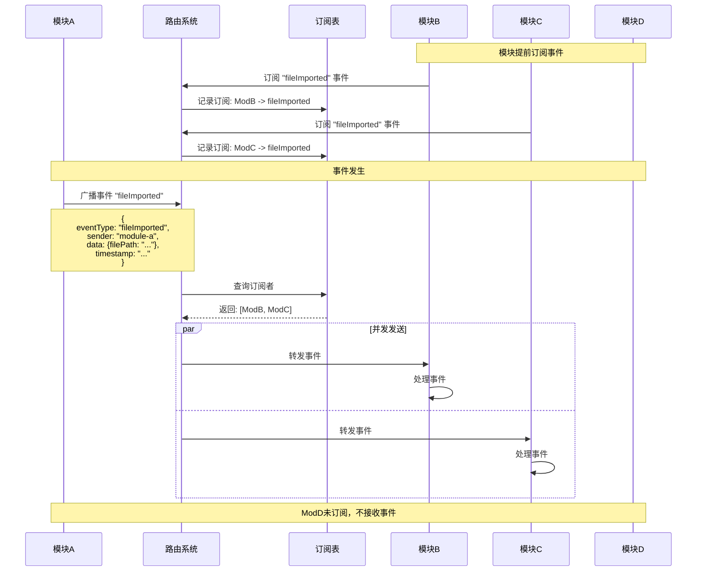

**流程说明**：

**订阅阶段**：
1. 模块调用`subscribe(eventType)`订阅感兴趣的事件类型
2. 内核在订阅表中记录：`eventType -> [模块列表]`
3. 同一模块可以订阅多种事件类型
4. 同一事件类型可以有多个订阅者

**广播阶段**：
1. 模块A发生事件，调用`broadcast(eventType, data)`
2. 内核查询订阅表，找到所有订阅者
3. 并发地向所有订阅者转发事件
4. 不等待订阅者处理完成（异步）
5. 未订阅的模块不会收到事件

**取消订阅**：
1. 模块调用`unsubscribe(eventType)`
2. 内核从订阅表中移除该模块
3. 模块卸载时自动取消所有订阅

**使用场景**：
- 文件导入完成，通知所有关心的模块
- 用户设置变更，通知相关模块更新
- 主题切换，通知UI组件刷新

## 4.3 模块生命周期流程

### 4.3.1 模块加载流程

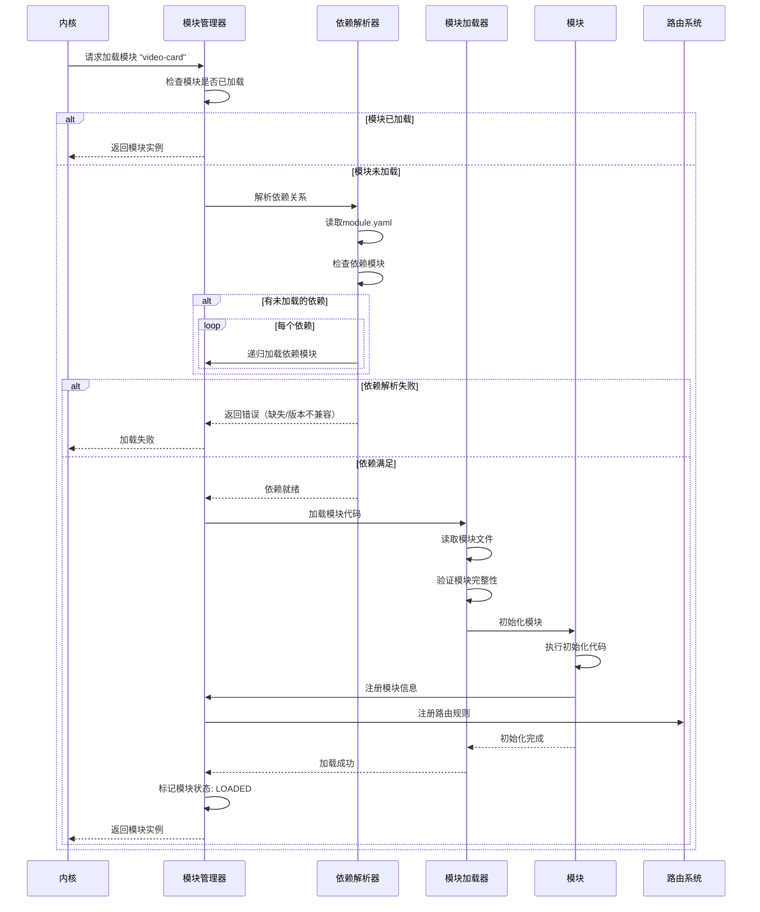

**详细步骤**：

**步骤1：加载请求**
- 内核收到加载模块的请求（由路由触发或显式加载）
- 请求包含模块ID

**步骤2：检查模块状态**
- 检查模块是否已加载
- 如果已加载，直接返回模块实例
- 如果正在加载中，等待加载完成
- 如果未加载，继续加载流程

**步骤3：依赖解析**
- 读取模块的`module.yaml`
- 提取依赖列表
- 检查每个依赖模块：
  - 是否已安装
  - 版本是否兼容
  - 是否已加载
- 检测循环依赖

**步骤4：加载依赖**
- 按照依赖顺序递归加载依赖模块
- 如果依赖加载失败，中止当前模块加载
- 如果依赖版本不兼容，报错

**步骤5：加载模块代码**
- 读取模块文件（JS/Python/WASM等）
- 验证文件完整性（可选：签名验证）
- 加载到运行时环境

**步骤6：模块初始化**
- 执行模块的初始化函数（`onInit`）
- 模块向内核注册：
  - 模块ID、名称、版本
  - 提供的接口列表
  - 路由规则
  - 事件订阅

**步骤7：注册路由**
- 内核将模块的路由规则加入路由表
- 例如：`.mp4文件 -> video-card模块`

**步骤8：完成加载**
- 标记模块状态为`LOADED`
- 返回模块实例
- 记录加载日志

**失败处理**：
- 依赖缺失：提示需要安装的依赖
- 版本不兼容：提示版本要求和当前版本
- 文件损坏：提示重新安装模块
- 初始化错误：记录详细错误日志，标记模块为不可用

### 4.3.2 模块卸载流程

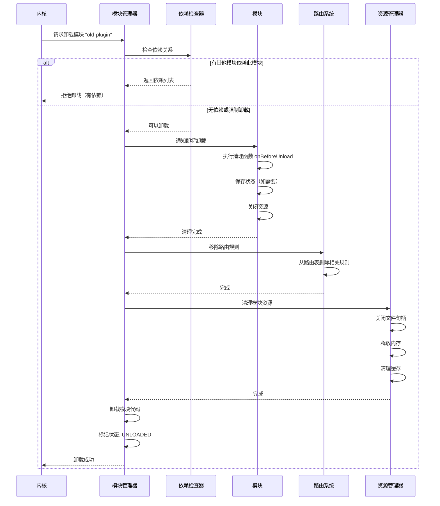

**详细步骤**：

**步骤1：依赖检查**
- 检查是否有其他模块依赖当前模块
- 如果有依赖且不是强制卸载，拒绝卸载
- 如果强制卸载，通知依赖模块（可能导致错误）

**步骤2：通知模块**
- 调用模块的`onBeforeUnload`钩子
- 模块执行清理操作：
  - 保存状态
  - 关闭文件
  - 取消事件订阅
  - 终止后台任务

**步骤3：移除路由**
- 从路由表中删除模块注册的所有路由规则
- 之后的请求不会再路由到这个模块

**步骤4：清理资源**
- 关闭模块打开的所有文件句柄
- 释放模块分配的内存
- 清理模块的缓存数据
- 取消所有事件订阅

**步骤5：卸载代码**
- 从运行时环境中移除模块代码
- 释放内存
- 标记模块状态为`UNLOADED`

**步骤6：记录日志**
- 记录卸载操作
- 包含卸载原因、时间等信息

## 4.4 文件处理流程

### 4.4.1 用户拖入文件流程

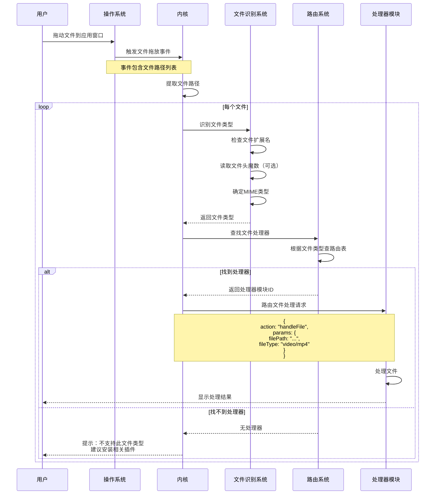

**流程说明**：

**步骤1：拖放事件**
- 用户从文件管理器拖动文件到应用窗口
- 操作系统捕获拖放事件
- 传递文件路径列表到内核

**步骤2：文件识别**
- 内核提取文件路径
- 对每个文件进行类型识别：
  - 首先检查文件扩展名（.mp4、.jpg、.card等）
  - 可选：读取文件头魔数进行二次验证
  - 确定MIME类型

**步骤3：查找处理器**
- 根据文件类型查找路由表
- 查找顺序：
  1. 用户自定义的默认处理器
  2. 文件类型注册的处理器
  3. 通用文件处理器

**步骤4：路由请求**
- 构造文件处理请求
- 通过路由系统发送给处理器模块

**步骤5：模块处理**
- 处理器模块接收请求
- 根据文件类型执行相应逻辑：
  - .card文件 → 打开卡片
  - .mp4文件 → 创建视频卡片
  - .jpg文件 → 创建图片卡片
  - 等等

**步骤6：显示结果**
- 处理器模块完成处理
- 更新界面，显示导入的内容

**错误处理**：
- 找不到处理器：提示用户安装相关插件
- 文件格式错误：提示文件损坏或格式不支持
- 处理失败：显示详细错误信息

### 4.4.2 打开卡片文件流程

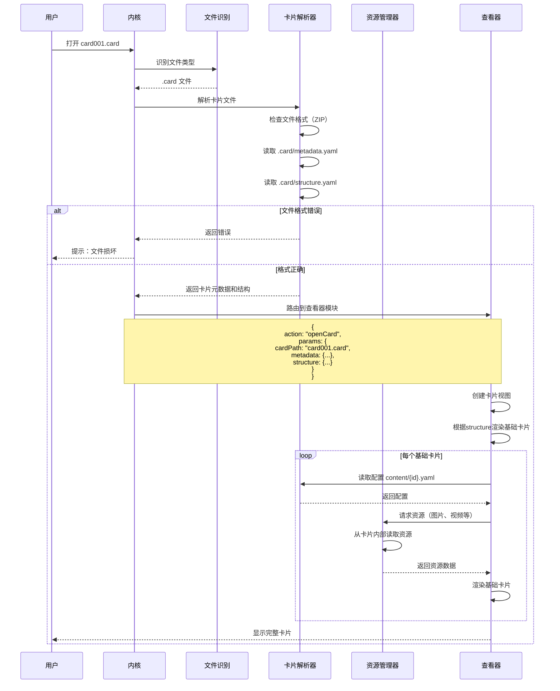

**流程说明**：

**步骤1：文件识别**
- 识别`.card`文件
- 验证文件格式（本质是ZIP）

**步骤2：解析元数据**
- 读取`.card/metadata.yaml`
- 获取卡片ID、名称、创建时间、标签等信息
- 检查卡片格式版本兼容性

**步骤3：解析结构**
- 读取`.card/structure.yaml`
- 获取卡片包含的基础卡片列表及顺序

**步骤4：路由到查看器**
- 将卡片信息路由到查看器模块
- 查看器根据卡片类型选择合适的渲染器

**步骤5：渲染卡片**
- 按照structure中的顺序渲染每个基础卡片
- 对于每个基础卡片：
  - 读取`content/{id}.yaml`配置
  - 根据类型加载对应的渲染器插件
  - 通过资源管理器获取资源（图片、视频等）
  - 渲染到界面上

**步骤6：资源加载**
- 资源管理器根据配置中的路径加载资源
- 相对路径：从卡片内部读取
- 绝对路径：从文件系统读取
- URL：从网络下载（可能使用缓存）

**步骤7：显示完成**
- 所有基础卡片渲染完成
- 用户可以查看和交互

## 4.5 资源访问流程

### 4.5.1 统一资源访问流程

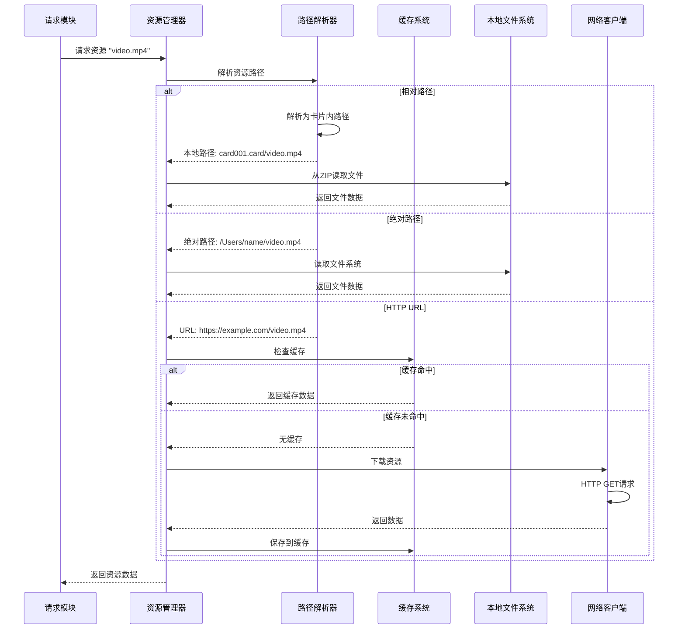

**流程说明**：

**步骤1：资源请求**
- 模块调用资源管理接口：`resource.read(path)`
- 传递资源路径（可能是相对路径、绝对路径或URL）

**步骤2：路径解析**
- 解析路径类型：
  - 相对路径（`video.mp4`）→ 卡片内部资源
  - 绝对路径（`/Users/name/video.mp4`）→ 文件系统
  - URL（`https://...`）→ 网络资源
  - 网盘路径（`webdav://...`）→ 网盘资源

**步骤3：资源获取**

**本地资源**：
- 直接从文件系统读取
- 卡片内资源：从ZIP文件中读取

**网络资源**：
- 检查缓存
- 缓存命中：直接返回
- 缓存未命中：下载资源
- 下载后保存到缓存

**网盘资源**：
- 检查认证信息
- 通过WebDAV或网盘API访问
- 可选：下载到本地缓存

**步骤4：返回数据**
- 将资源数据返回给请求模块
- 可能是文件流、文件句柄或完整数据

**错误处理**：
- 资源不存在：返回404错误
- 网络超时：返回超时错误
- 权限不足：返回403错误
- 格式错误：返回格式错误提示

### 4.5.2 资源缓存流程

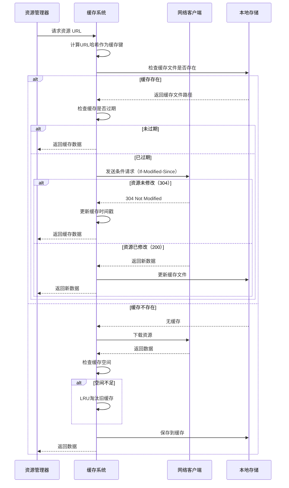

**流程说明**：

**步骤1：检查缓存**
- 计算资源URL的哈希值作为缓存键
- 检查缓存目录是否有对应文件

**步骤2：缓存命中**
- 检查缓存是否过期（根据HTTP缓存头或配置的过期时间）
- 未过期：直接返回缓存数据
- 已过期：发送条件请求验证

**步骤3：条件请求**
- 使用`If-Modified-Since`或`If-None-Match`头
- 如果服务器返回304：资源未修改，继续使用缓存
- 如果服务器返回200：资源已修改，更新缓存

**步骤4：缓存未命中**
- 下载资源
- 检查缓存空间是否足够
- 空间不足时，使用LRU策略淘汰旧缓存
- 保存新资源到缓存

**缓存策略**：
- 默认缓存时间：根据HTTP缓存头
- 最大缓存大小：1GB（可配置）
- 淘汰策略：LRU（最近最少使用）
- 缓存目录：`~/.chips/cache/resources/`

## 4.6 配置管理流程

### 4.6.1 配置加载流程

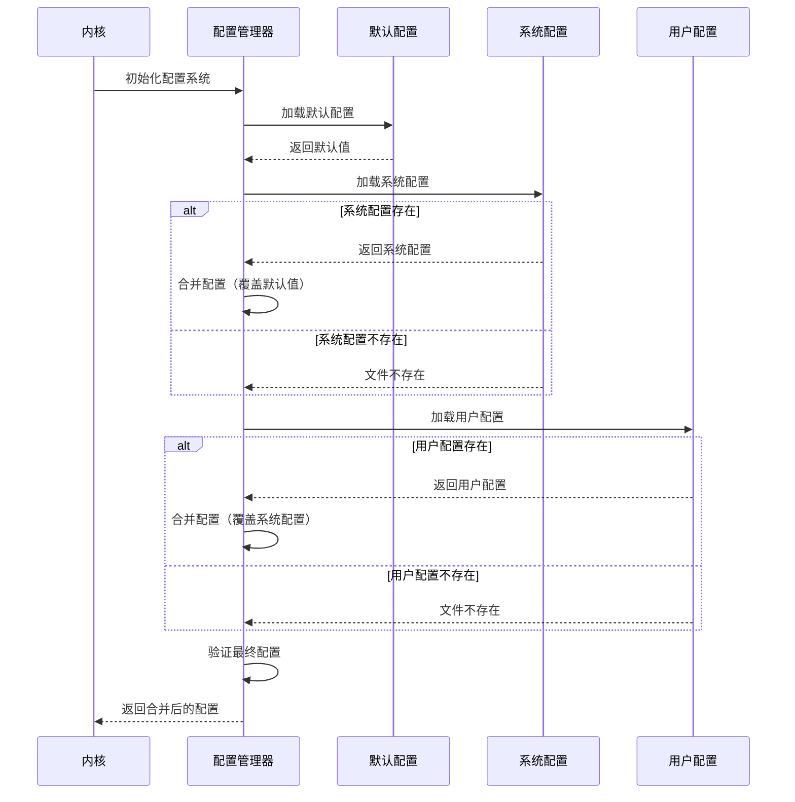

**配置层级**：

1. **默认配置**（优先级最低）
   - 硬编码在内核中
   - 保证内核能正常启动

2. **系统配置**（中等优先级）
   - 位置：`/etc/chips/config.yaml`（Linux/macOS）或`C:\ProgramData\Chips\config.yaml`（Windows）
   - 适用于所有用户
   - 需要管理员权限修改

3. **用户配置**（优先级最高）
   - 位置：`~/.chips/config.yaml`
   - 用户个人配置
   - 普通用户可修改

**配置合并规则**：
- 后面的配置覆盖前面的配置
- 对象类型：深度合并
- 数组类型：完全替换

**示例**：

默认配置：
```yaml
router:
  timeout: 30
  concurrency: 4
  log_level: "INFO"
```

用户配置：
```yaml
router:
  timeout: 60
  log_level: "DEBUG"
```

最终配置：
```yaml
router:
  timeout: 60          # 用户配置覆盖
  concurrency: 4       # 保留默认值
  log_level: "DEBUG"   # 用户配置覆盖
```

## 流程总结

本文档详细描述了薯片内核的关键业务流程，包括：

1. **启动流程**：从进程启动到应用就绪的完整过程
2. **模块通信**：路由请求和事件广播的详细机制
3. **模块生命周期**：加载和卸载的完整流程
4. **文件处理**：从用户操作到文件解析的全链路
5. **资源访问**：统一资源接口的实现机制
6. **配置管理**：多层配置的加载和合并逻辑

所有流程都强调：
- 清晰的职责划分
- 完善的错误处理
- 详细的日志记录
- 高性能和可扩展性

这些流程为技术文档的详细设计提供了基础。
